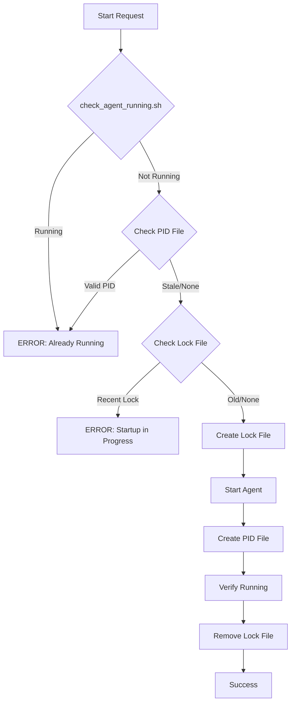

# Voice Agent Duplicate Prevention System

## Problem
Voice agents getting started multiple times causes:
- Audio cutting off during speech (agents compete for audio stream)
- "Waiting for agent to join" issues
- Resource waste and confusion

## Solutions Implemented (Dec 2024)

### 1. PID File Locking ✅

**File**: `/tmp/letta_voice_agent.pid`

The system creates a PID file when starting and checks it before allowing new starts:

```bash
# Check if PID file exists and process is still running
if [ -f "/tmp/letta_voice_agent.pid" ]; then
    PID=$(cat /tmp/letta_voice_agent.pid)
    if ps -p $PID > /dev/null; then
        echo "Agent already running!"
        exit 1
    fi
fi
```

**Cleanup**: PID file is removed when agent stops

### 2. Lock File During Startup ✅

**File**: `/tmp/letta_voice_agent.lock`

Prevents race conditions when multiple scripts try to start agents simultaneously:

```bash
# Creates lock file during 30-second startup window
echo $$ > /tmp/letta_voice_agent.lock
trap "rm -f /tmp/letta_voice_agent.lock" EXIT
```

**Auto-cleanup**: Lock file is automatically removed after 30 seconds or when script exits

### 3. Pre-Start Duplicate Detection ✅

**Script**: `check_agent_running.sh`

Checks for duplicates before allowing any start:
- Counts running processes
- Checks PID file validity
- Checks lock file age
- Rejects start if ANY duplicates found

Usage:
```bash
./check_agent_running.sh || exit 1
```

### 4. Safe Starter Wrapper ✅

**Script**: `start_voice_agent_safe.sh`

Combines all protections:
1. Runs pre-start check
2. Creates lock file
3. Starts agent
4. Creates PID file
5. Verifies startup
6. Auto-removes lock on exit

Usage:
```bash
./start_voice_agent_safe.sh
```

### 5. Safe Stopper ✅

**Script**: `stop_voice_agent_safe.sh`

Properly cleans up all tracking files:
- Reads PID file and kills process
- Removes PID file
- Removes lock file
- Kills any remaining processes

Usage:
```bash
./stop_voice_agent_safe.sh
```

### 6. Enhanced Start Script ✅

**Script**: `start_voice_system.sh`

Now uses safe starter internally:
- Detects existing agents
- Kills duplicates if found
- Uses safe starter with locking
- Won't create duplicates even if run multiple times

### 7. Enhanced Restart Script ✅

**Script**: `restart_voice_system.sh`

Now uses safe stopper:
- Properly cleans up PID/lock files
- Reports duplicate count
- Uses safe starter for clean restart

### 8. Systemd Service (Optional) ✅

**File**: `systemd/letta-voice-agent-safe.service`

Production-grade solution:
- Systemd guarantees single instance
- Automatic restart on failure
- Proper PID file management
- Integrated with system logging

Setup:
```bash
sudo cp systemd/letta-voice-agent-safe.service /etc/systemd/system/
sudo systemctl daemon-reload
sudo systemctl enable letta-voice-agent-safe
sudo systemctl start letta-voice-agent-safe
```

## How It Works

### Starting the Agent



### Multiple Simultaneous Start Attempts

```
Time    Script 1              Script 2              Result
----    --------              --------              ------
0s      check_agent_running   -                     ✅ Pass
1s      create lock           -                     ✅ Locked
2s      starting agent        check_agent_running   ❌ Sees lock, exits
3s      agent running         -                     -
4s      create PID file       -                     -
5s      remove lock           -                     ✅ Done
```

**Result**: Only ONE agent starts, Script 2 is rejected

## Troubleshooting

### Problem: "Already running" but no process found

**Cause**: Stale PID file from crashed agent

**Fix**:
```bash
rm -f /tmp/letta_voice_agent.pid /tmp/letta_voice_agent.lock
```

### Problem: "Startup in progress" error

**Cause**: Lock file from recent start (< 30 seconds)

**Fix**: Wait 30 seconds OR remove stale lock:
```bash
# Only if you're sure no startup is happening
rm -f /tmp/letta_voice_agent.lock
```

### Problem: Still getting duplicates

**Cause**: Old script being used, not the safe version

**Fix**: Always use one of these:
```bash
./start_voice_system.sh      # Recommended
./restart_voice_system.sh    # For restarts
./start_voice_agent_safe.sh  # Direct start
```

DON'T use:
```bash
python letta_voice_agent.py dev  # No protection!
```

## Migration Guide

### Before (Old Method)
```bash
# Direct start - NO protection
cd /home/adamsl/planner/a2a_communicating_agents/hybrid_letta_agents
python letta_voice_agent.py dev &
```

### After (New Method)
```bash
# Protected start
cd /home/adamsl/planner/a2a_communicating_agents/hybrid_letta_agents
./start_voice_agent_safe.sh
```

OR use the full system script:
```bash
./start_voice_system.sh  # Now uses safe starter internally
```

## Files Created

| File | Purpose |
|------|---------|
| `check_agent_running.sh` | Pre-start duplicate detection |
| `start_voice_agent_safe.sh` | Safe starter with locking |
| `stop_voice_agent_safe.sh` | Safe stopper with cleanup |
| `/tmp/letta_voice_agent.pid` | PID tracking file |
| `/tmp/letta_voice_agent.lock` | Startup lock file |
| `systemd/letta-voice-agent-safe.service` | Systemd service (optional) |

## Testing

Verify duplicate prevention works:

```bash
# Terminal 1
./start_voice_agent_safe.sh

# Terminal 2 (while Terminal 1 is starting)
./start_voice_agent_safe.sh
# Should see: "ERROR: Already running or locked"
```

## Production Recommendations

For production use, consider:

1. **Use Systemd** - Best guarantee of single instance
2. **Monitor PID file** - Alert if stale files accumulate
3. **Log rotation** - Voice agent logs can grow large
4. **Resource limits** - Set in systemd service file

## Summary

The duplicate prevention system provides:
- ✅ **PID file locking** - Tracks running instance
- ✅ **Lock files** - Prevents race conditions
- ✅ **Pre-start checks** - Rejects duplicates before starting
- ✅ **Safe wrappers** - All protections in one command
- ✅ **Automatic cleanup** - Files removed on stop
- ✅ **Systemd option** - Production-grade management

**Result**: Duplicates should be impossible with proper script usage!
