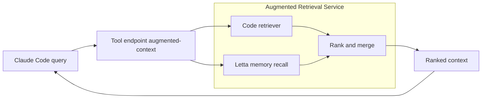

# Letta + Claude Code: Augmented Retrieval Use Guide

**Version:** 1.0  
**Audience:** Engineering team evaluating Letta as a programmable memory layer that augments Claude Code’s retrieval pipeline.

> **TL;DR**: We run a tiny Node/Express service that merges *normal code retrieval* (grep/embeddings) with **Letta memory** (errors, test logs, PR decisions). Claude Code calls a single endpoint to get a *ranked* context bundle. This surfaces tacit knowledge (what actually happened) alongside static code/doc hits.

---

## 1) Executive Summary

- **Problem**: Code-only retrieval misses real-world context: prior failures, known gotchas, PR outcomes, CI decisions.
- **Approach**: Use **Letta memory** to log these artifacts and **rank** them together with code hits for Claude Code.
- **Result**: Answers become *faster and more accurate*, especially for recurring issues (“we intentionally ignore invalid `Content-Length`”, etc.).

---

## 2) Architecture (at a glance)



- **Inputs**: Query text (and optional `filePath`).
- **Sources**: Code retriever + Letta memory (errors, run logs, PR notes, decisions).
- **Output**: Top-*k* ranked snippets with type: `"code_snippet"` or `"memory"`.

---

## 3) Prerequisites

- Node.js 18+
- TypeScript (optional but recommended)
- **Letta** (conceptual API used here): `new Letta(); letta.memory(); letta.remember(); letta.recall()`  
  > *Note*: Adjust imports/method names to the concrete Letta package version your team standardizes on.
- Your existing **code retriever** (ripgrep, embeddings index, vector DB, etc.). The guide provides a stub to replace.

---

## 4) Project Layout

```
my-letta-integration/
├── src/
│   ├── server.ts            # Express service: /log, /augmented-context
│   ├── scoring.ts           # Tokenization, jaccard, time-decay blend
│   └── memoryTypes.ts       # MemoryItem types
├── package.json
├── tsconfig.json
└── README.md
```

---

## 5) Install & Run

```bash
# 1) Initialize
npm init -y

# 2) Add deps
npm install express body-parser letta
npm install -D typescript ts-node @types/node @types/express

# 3) Add scripts (package.json)
# "scripts": { "dev": "ts-node src/server.ts" }

# 4) Start
npm run dev
# -> Augmented retriever on http://localhost:3030
```

---

## 6) API Spec

### 6.1 `POST /log` — Ingest artifacts into Letta memory

Use this to log **errors, CI output, PR decisions, run logs**, etc.

**Request**

```json
{
  "text": "Tests failing: TypeError: this.parser.on is not a function",
  "tags": ["error","runlog"],
  "source": "pytest",
  "filePath": "data_loader/json_data_loader.ts"
}
```

- `text` *(string, required)*: The artifact content.
- `tags` *(string[], optional)*: e.g. `["error","fix","decision","runlog"]`.
- `source` *(string, optional)*: e.g., `"pytest"`, `"CI"`, `"review"`.
- `filePath` *(string, optional)*: Tie memory to a module/file for better retrieval biasing.

**Response**

```json
{
  "ok": true,
  "stored": {
    "id": "abc123...",
    "text": "...",
    "tags": ["error","runlog"],
    "source": "pytest",
    "filePath": "data_loader/json_data_loader.ts",
    "timestamp": 1738872000000
  }
}
```

---

### 6.2 `POST /augmented-context` — Get merged & ranked context

**Request**

```json
{
  "query": "this.parser.on is not a function in json_data_loader.ts",
  "filePath": "data_loader/json_data_loader.ts",
  "limit": 8
}
```

- `query` *(string, required)*: The user’s natural-language request.
- `filePath` *(string, optional)*: If provided, we filter/boost relevant memory.
- `limit` *(number, optional)*: Max items returned (default 10).

**Response**

```json
{
  "query": "...",
  "context": [
    {
      "type": "memory",
      "score": 0.82,
      "text": "Tests failing: TypeError: this.parser.on is not a function",
      "tags": ["error","runlog"],
      "source": "pytest",
      "filePath": "data_loader/json_data_loader.ts",
      "timestamp": 1738872000000
    },
    {
      "type": "code_snippet",
      "score": 0.61,
      "text": "Fix: ensure parser implements EventEmitter and exposes 'on' before piping chunks"
    }
  ]
}
```

---

## 7) Reference Implementation (TypeScript)

> Replace the `fakeCodeRetriever()` with your real retriever (embeddings/ripgrep/AST).  
> Letta API calls below are **conceptual**—adapt to your installed version.

**`src/server.ts`**

```ts
import express from "express";
import bodyParser from "body-parser";
import { Letta } from "letta"; // Adjust to actual package
import { rankAndMerge } from "./scoring";
import { MemoryItem, AugmentedItem } from "./memoryTypes";

const app = express();
app.use(bodyParser.json());

const letta = new Letta();
// Initialize memory subsystem (adjust to actual Letta API)
letta.memory();

/** POST /log: store artifacts in memory */
app.post("/log", async (req, res) => {
  const { text, tags = [], source, filePath } = req.body as Partial<MemoryItem>;
  if (!text) return res.status(400).json({ error: "text required" });

  const item: MemoryItem = {
    id: cryptoRandomId(),
    text,
    tags,
    source,
    filePath,
    timestamp: Date.now()
  };

  await letta.remember("artifact", item);
  return res.json({ ok: true, stored: item });
});

/** POST /augmented-context: merge code + memory and rank */
app.post("/augmented-context", async (req, res) => {
  const { query, filePath, limit = 10 } = req.body as {
    query: string;
    filePath?: string;
    limit?: number;
  };
  if (!query) return res.status(400).json({ error: "query required" });

  const codeHits = await fakeCodeRetriever(query, filePath);

  const raw = await letta.recall("artifact"); // [{ data: MemoryItem, ... }]
  const memories: MemoryItem[] = raw
    .map((e: any) => e.data as MemoryItem)
    .filter(m => !filePath || m.filePath === filePath);

  const ranked = rankAndMerge(query, codeHits, memories, limit);
  const context: AugmentedItem[] = ranked.map(r => {
    if (r.kind === "code") {
      return { type: "code_snippet", score: r.score, text: r.snippet };
    }
    const m = r.mem as MemoryItem;
    return {
      type: "memory",
      score: r.score,
      text: m.text,
      tags: m.tags,
      source: m.source,
      filePath: m.filePath,
      timestamp: m.timestamp
    };
  });

  return res.json({ query, context });
});

async function fakeCodeRetriever(query: string, filePath?: string): Promise<string[]> {
  // Replace with embeddings, ripgrep, or AST-aware snippet fetcher.
  const demo = [
    `TypeError: cannot read property 'on' of undefined in json_data_loader.ts:145`,
    `Fix: ensure parser implements EventEmitter and exposes 'on' before piping chunks`,
    `PR #214 notes: switch to incremental JSON parser; ignore invalid Content-Length`
  ];
  return demo.filter(s => !filePath || s.includes(filePath || ""));
}

function cryptoRandomId(): string {
  return Math.random().toString(36).slice(2) + Date.now().toString(36);
}

const PORT = 3030;
app.listen(PORT, () => console.log(`Augmented retriever on http://localhost:${PORT}`));
```

**`src/scoring.ts`**

```ts
import { MemoryItem } from "./memoryTypes";

function tokenize(s: string): Set<string> {
  return new Set(
    s.toLowerCase().replace(/[^\w]+/g, " ").split(" ").filter(Boolean)
  );
}

function jaccard(a: Set<string>, b: Set<string>): number {
  const inter = new Set([...a].filter(x => b.has(x)));
  const union = new Set([...a, ...b]);
  return union.size ? inter.size / union.size : 0;
}

function timeDecay(ts: number, now = Date.now()): number {
  // ~0.1 decay per 7 days
  const days = (now - ts) / (1000 * 60 * 60 * 24);
  const decay = Math.exp(-0.1 * (days / 7));
  return decay; // [0..1]
}

export function rankAndMerge(
  query: string,
  codeHits: string[],
  lettaHits: MemoryItem[],
  k = 8
) {
  const q = tokenize(query);

  const scoredCode = codeHits.map((snippet, i) => {
    const s = tokenize(snippet);
    return { kind: "code" as const, score: jaccard(q, s), snippet, rankTiebreak: i };
  });

  const scoredMem = lettaHits.map((m, i) => {
    const s = tokenize(m.text);
    const overlap = jaccard(q, s);
    const recency = timeDecay(m.timestamp);
    const tagBoost = m.tags?.some(t => ["error","fix","decision","runlog"].includes(t)) ? 0.10 : 0;
    const score = overlap * 0.7 + recency * 0.25 + tagBoost;
    return { kind: "memory" as const, score, mem: m, rankTiebreak: i };
  });

  return [...scoredCode, ...scoredMem]
    .sort((a, b) => b.score - a.score || a.rankTiebreak - b.rankTiebreak)
    .slice(0, k);
}
```

**`src/memoryTypes.ts`**

```ts
export type MemoryItem = {
  id: string;
  text: string;
  tags: string[];
  source?: string;
  filePath?: string;
  timestamp: number;
};

export type AugmentedItem =
  | { type: "code_snippet"; score: number; text: string; }
  | {
      type: "memory";
      score: number;
      text: string;
      tags?: string[];
      source?: string;
      filePath?: string;
      timestamp?: number;
    };
```

---

## 8) Scoring (why results are good)

We blend three signals:

1. **Token overlap** (Jaccard): matches user query words to snippet/memory (`70%` weight).
2. **Recency** (time-decay): newer memories boosted (`25%` weight).
3. **Tag bonus**: `"error" | "fix" | "decision" | "runlog"` add **+0.10**.

> Tweak weights as needed; add embeddings for semantic matching later.

---

## 9) Claude Code Integration

Claude Code (or any tool-calling system) calls the **single endpoint**:

```json
{
  "tool_name": "augmented_retriever",
  "url": "http://localhost:3030/augmented-context",
  "method": "POST",
  "payload": {
    "query": "<user text>",
    "filePath": "<optional active file>",
    "limit": 8
  }
}
```

The returned `context` array drops straight into your prompt construction pipeline.

---

## 10) Security & Privacy

- **PII**: Do not log secrets into memory. Add a redactor on `/log` (regex scrub tokens, keys).
- **Access control**: Restrict service to localhost or behind your gateway + service token.
- **Rotation**: Consider TTLs or nightly compaction for memory growth.
- **Audit**: Memory items are identifiable (`id`, `timestamp`, `source`); keep an audit trail if needed.

---

## 11) Persistence Options

- **In-memory** (default): simplest, stateless (ephemeral).
- **File-backed**: JSONL store with rolling files (daily rotation).
- **SQLite**: `better-sqlite3` for small ops, per-project DBs.
- **Cloud DB**: Postgres or a vector DB when adding embeddings.

> Letta’s memory adapter conceptually lets you swap backends—keep the `remember/recall` interface stable.

---

## 12) Typical Workflows

### A) Debugging Loop
1. Test fails → CI posts error with `/log`.
2. Developer queries: “parser .on is not a function” → `/augmented-context` returns prior failures + code hints.
3. Claude uses both to propose a fix, referencing the *exact* prior incident.

### B) PR Knowledge Capture
- Reviewer writes rationale: “Ignore invalid Content-Length by design.” → `/log` with tags `["decision"]` + `filePath`.
- Future questions about `Content-Length` surface this decision immediately.

### C) Incident Postmortems
- During an outage, dump run logs via `/log` tagged `["incident","runlog"]`.
- Postmortem queries retrieve the timeline alongside code diffs.

---

## 13) Deployment Notes

- **Docker**: package the service; run behind your reverse proxy (Caddy/Nginx), enable health-checks.
- **Env Vars**: `PORT`, memory backend config (`MEM_BACKEND=file|sqlite`, file path, DB URL).
- **Observability**: add request logs & latency metrics; count `/log` and `/augmented-context` rates.

---

## 14) Troubleshooting

- **Empty results**: confirm `/log` is being called and memory contains items; check `filePath` filters.
- **Irrelevant hits**: adjust weights; add embeddings; tweak tag bonus; remove stop-words in tokenizer.
- **Bloated memory**: enable TTL; run nightly compaction; move to SQLite with indices on `filePath`, `tags`, `timestamp`.
- **Security warnings**: add token auth and IP allowlists; redact secrets on `/log`.

---

## 15) Roadmap (Optional Enhancements)

- **Embeddings**: add cosine similarity with a small local model or service.
- **Rerankers**: use a lightweight reranker (e.g., cross-encoder) on the top 50 candidates.
- **Playbooks**: encode fixes as memory with structured fields (`pattern`, `resolution`, `owner`).
- **UI**: small dashboard to browse memory, edit tags, and replay decision history.

---

## 16) FAQ

**Q: How is this different from Claude Code’s built-in memory?**  
A: Letta memory is **programmable** and **structured**; you can log arbitrary artifacts and query them at runtime. Claude’s built-in memory is great for *preferences/context*, but it’s not tool-queryable or schema-rich.

**Q: What if Letta’s actual API differs?**  
A: This guide uses a **conceptual** Letta API (`remember/recall`). Map these calls to your concrete version. The architecture and interfaces remain the same.

**Q: Do we need embeddings on day one?**  
A: No. Token overlap + recency already gives strong signal. Add embeddings later if needed.

---

## 17) License / Attribution

- This reference implementation is provided as a starting point. Review and adapt for your environment and the specific Letta package version your team uses.

---

### Appendix: cURL Examples

**Log an error**

```bash
curl -X POST http://localhost:3030/log \
  -H "Content-Type: application/json" \
  -d '{
    "text": "Tests failing: TypeError: this.parser.on is not a function",
    "tags": ["error","runlog"],
    "source": "pytest",
    "filePath": "data_loader/json_data_loader.ts"
  }'
```

**Fetch augmented context**

```bash
curl -X POST http://localhost:3030/augmented-context \
  -H "Content-Type: application/json" \
  -d '{
    "query": "this.parser.on is not a function in json_data_loader.ts",
    "filePath": "data_loader/json_data_loader.ts",
    "limit": 8
  }'
```