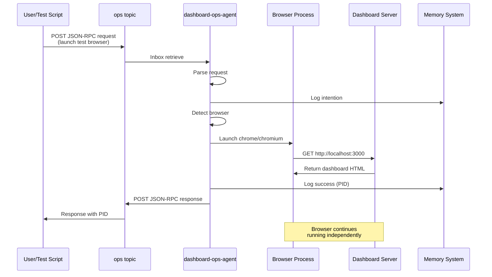
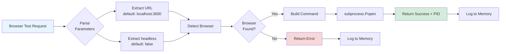

# Dashboard Agent Browser Testing - Architecture

## System Architecture

```mermaid
graph TD
    User[User/Orchestrator] -->|JSON-RPC Request| OPS[ops topic]
    OPS -->|Inbox| Agent[dashboard-ops-agent]
    
    Agent -->|check_server_status| Server{Dashboard Server<br/>localhost:3000}
    Agent -->|start_server| Server
    Agent -->|start_test_browser| BrowserDetect[Browser Detection]
    
    BrowserDetect -->|Search| Chrome[/usr/bin/google-chrome]
    BrowserDetect -->|Search| Chromium[chromium-browser]
    BrowserDetect -->|Found| Launch[Launch Browser Process]
    
    Launch -->|Opens| Browser[Browser Window]
    Browser -->|Navigates to| Server
    
    Agent -->|Logs| Memory[(RAG Memory System)]
    Agent -->|Response| OPS
    
    style Agent fill:#4A90E2,color:#fff
    style Server fill:#50C878,color:#fff
    style Browser fill:#FF6B6B,color:#fff
    style Memory fill:#FFD93D,color:#333
```

## Message Flow



## Component Responsibilities

| Component | Responsibility |
|-----------|---------------|
| **dashboard-ops-agent** | Orchestrates browser testing, server management |
| **Browser Detection** | Finds available Chrome/Chromium installation |
| **Process Management** | Launches browser as subprocess, tracks PID |
| **Memory System** | Logs all operations for audit/debugging |
| **ops Topic** | Message bus for agent communication |

## Capability Flow



## Integration Points

### 1. Agent Messaging System
- Uses standard JSON-RPC 2.0 protocol
- Topic-based pub/sub architecture
- Asynchronous message processing

### 2. RAG Memory System
- All operations logged with metadata
- Searchable for debugging
- Audit trail for compliance

### 3. Dashboard Server
- Standard HTTP server
- Health check via GET request
- Configurable port (default: 3000)

### 4. Browser Process
- Independent subprocess
- Detached from agent lifecycle
- Can be tracked via PID

## File Structure

```
planner/
├── dashboard_ops_agent/
│   ├── agent.json              # Capability definitions
│   └── main.py                 # Implementation
├── test_dashboard_browser.py   # Test utility
├── DASHBOARD_BROWSER_TESTING.md # User documentation
└── DASHBOARD_BROWSER_ARCHITECTURE.md # This file
```

## Technology Stack

- **Python 3.x** - Agent runtime
- **subprocess** - Browser process management  
- **requests** - HTTP health checks
- **Chrome/Chromium** - Test browser
- **JSON-RPC 2.0** - Agent protocol
- **RAG System** - Memory/logging

## Security Considerations

1. **Process Isolation**: Browser runs as separate process
2. **No Shell Injection**: Uses subprocess.Popen with list args
3. **Limited Scope**: Only launches browsers, no file system access
4. **Audit Trail**: All actions logged to memory system

## Performance Characteristics

- **Browser Launch Time**: ~2-3 seconds
- **Health Check Timeout**: 2 seconds
- **Agent Loop Interval**: 10 seconds
- **Memory Impact**: Minimal (subprocess delegation)

## Extension Possibilities

### Future Enhancements
1. **Screenshot Capture**: Save screenshots via headless mode
2. **Automated Testing**: Integrate Selenium/Playwright
3. **Performance Metrics**: Capture page load times
4. **Visual Regression**: Compare screenshots
5. **Multi-browser Support**: Firefox, Safari, Edge
6. **Headless CI/CD**: Automated pipeline tests

### Code Example: Screenshot Extension
```python
def capture_screenshot(url, output_path):
    """Capture screenshot using headless browser"""
    cmd = [
        browser_path,
        "--headless",
        "--disable-gpu",
        "--screenshot=" + output_path,
        "--window-size=1920,1080",
        url
    ]
    subprocess.run(cmd, timeout=10)
    return output_path
```

## Monitoring & Observability

### Logs to Check
- Agent stdout: Real-time operation logs
- Memory system: Structured operation history
- Browser console: Via remote debugging port

### Health Indicators
- Browser process running (check PID)
- Server responding (HTTP 200)
- Memory logs show success

### Debugging Commands
```bash
# Check if browser is running
ps aux | grep chrome | grep -v grep

# Check server status
curl -I http://localhost:3000

# View recent agent memory
python -c "from rag_system.core.document_manager import DocumentManager; \
           dm = DocumentManager(); \
           print(dm.search('dashboard browser', limit=5))"
```

---

**Last Updated:** 2025-11-19  
**Version:** 1.0
