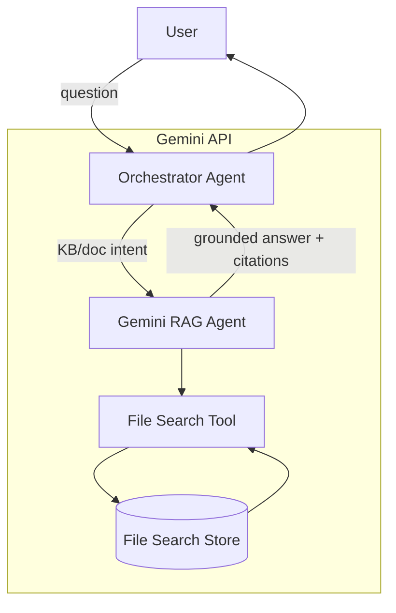

# Gemini Agents, File Search (RAG), and Structured Outputs

## Project Overview

This repository demonstrates:

1) **Agent Orchestration with Google ADK**  
   `adk_subagents.py` builds a small agent team using the Google Agent Development Kit (ADK). The **orchestrator** routes requests to specialized sub-agents (diagram, farewell) and now includes a **Gemini RAG agent** that grounds answers with your documents via Gemini’s managed **File Search** tool.

2) **Managed RAG with Gemini File Search**  
   The new **`gemini_rag_agent`** uses the Gemini API’s **File Search** tool to retrieve, cite, and ground responses from a **File Search store** you control—no separate vector DB required. Use `setup_file_search_store.py` to create a store, upload files, and (optionally) run a smoke test.

3) **Structured Outputs with Pydantic**  
   `test_pydantic.py` shows enforcing predictable JSON using schema-driven structured outputs—now first-class in the Gemini API and compatible with libraries like Pydantic/Zod.


## What’s New

- **Gemini RAG Agent (`gemini_rag_agent`)** wired into `adk_subagents.py`  
  Delegates knowledge/KB/“our docs” queries to Gemini with **File Search** enabled, returning grounded answers (with citations) from your store.

- **Store Setup Utility (`setup_file_search_store.py`)**  
  Creates or reuses a File Search store, bulk-uploads files (optional chunk config), waits for indexing, and can run a smoke query. Outputs the store name for `GEMINI_FILE_SEARCH_STORE`.


## Tech Stack

- **Google ADK (Python)** for multi-agent orchestration: agents, runners, sessions.  
- **Google Gen AI Python SDK (`google-genai`)** for the Gemini API, including **File Search** and structured outputs.  
- **Pydantic** (structured validation).  
- **LiteLLM** (optional) to mix non-Gemini models with ADK.


## Install & Setup

Create a virtual environment (recommended) and install dependencies:

```bash
python -m venv .venv
source .venv/bin/activate  # Windows: .venv\Scripts\Activate.ps1
pip install google-adk google-genai pydantic litellm
```

Set your API key:

```bash
export GOOGLE_API_KEY="YOUR_KEY"   # or: export GEMINI_API_KEY="YOUR_KEY"
```


## Preparing Your File Search Store (Managed RAG)

Use the included setup script:

```bash
python setup_file_search_store.py \
  --display-name "my-kb-store" \
  --paths ./kb \
  --reuse-if-exists
```

```bash
# optional smoke test
python setup_file_search_store.py \
  --display-name "my-kb-store" \
  --paths ./kb/**/*.pdf ./policies/*.md \
  --reuse-if-exists \
  --chunk-tokens 300 --chunk-overlap 30 \
  --test-query "Summarize our onboarding policy and list the top steps."
```

```bash
export GEMINI_FILE_SEARCH_STORE="fileSearchStores/your-store-id"
```


## Running the Examples

```bash
python adk_subagents.py
python test_pydantic.py
```


## How the RAG Agent Works




## Configuration Reference

- `GOOGLE_API_KEY` / `GEMINI_API_KEY` – Gemini API auth.
- `GEMINI_FILE_SEARCH_STORE` – store name, e.g. `fileSearchStores/my-store-123`.
- Default RAG model: `gemini-2.5-flash`


## Troubleshooting

- `ModuleNotFoundError: litellm` – install with `pip install litellm`
- Use `google-genai`, not the old `google-generativeai`
- RAG answers look ungrounded? Check that your store is valid and used in tool config


## Development Conventions

- Keep agents single-purpose; let orchestrator route.
- Use structured outputs where possible.
- Prefer File Search over DIY vector DB for simplicity and citations.
