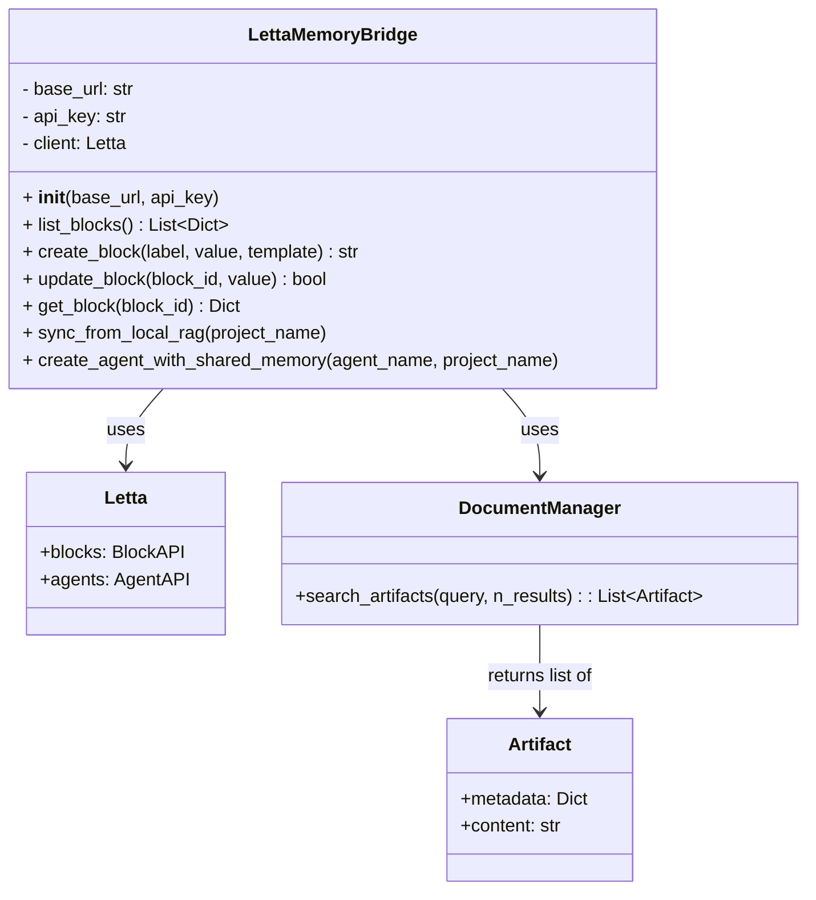

```mermaid
classDiagram
    class LettaMemoryBridge {
        - base_url: str
        - api_key: str
        - client: Letta
        + __init__(base_url, api_key)
        + list_blocks() List~Dict~
        + create_block(label, value, template) str
        + update_block(block_id, value) bool
        + get_block(block_id) Dict
        + sync_from_local_rag(project_name)
        + create_agent_with_shared_memory(agent_name, project_name)
    }

    class Letta {
        +blocks: BlockAPI
        +agents: AgentAPI
    }

    class DocumentManager {
        +search_artifacts(query, n_results): List~Artifact~
    }

    class Artifact {
        +metadata: Dict
        +content: str
    }

    LettaMemoryBridge --> Letta : uses
    LettaMemoryBridge --> DocumentManager : uses
    DocumentManager --> Artifact : returns list of
```
