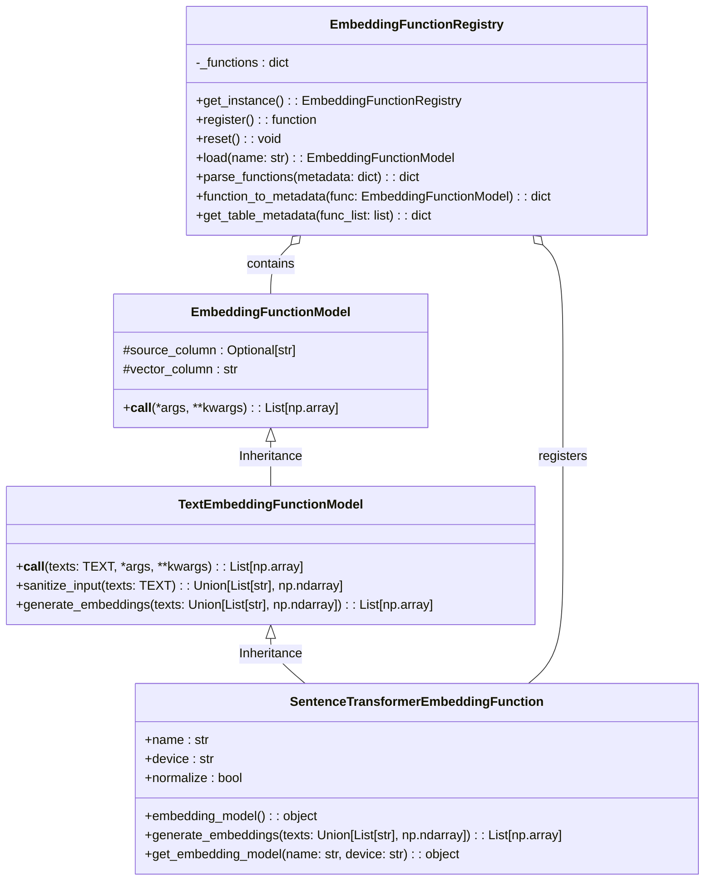

```mermaid
classDiagram

    class EmbeddingFunctionRegistry {
        +get_instance() : EmbeddingFunctionRegistry
        -_functions : dict
        +register() : function
        +reset() : void
        +load(name: str) : EmbeddingFunctionModel
        +parse_functions(metadata: dict) : dict
        +function_to_metadata(func: EmbeddingFunctionModel) : dict
        +get_table_metadata(func_list: list) : dict
    }

    class EmbeddingFunctionModel {
        #source_column : Optional[str]
        #vector_column : str
        +__call__(*args, **kwargs) : List[np.array]
    }

    class TextEmbeddingFunctionModel {
        +__call__(texts: TEXT, *args, **kwargs) : List[np.array]
        +sanitize_input(texts: TEXT) : Union[List[str], np.ndarray]
        +generate_embeddings(texts: Union[List[str], np.ndarray]) : List[np.array]
    }

    class SentenceTransformerEmbeddingFunction {
        +name : str
        +device : str
        +normalize : bool
        +embedding_model() : object
        +generate_embeddings(texts: Union[List[str], np.ndarray]) : List[np.array]
        +get_embedding_model(name: str, device: str) : object
    }

    EmbeddingFunctionModel <|-- TextEmbeddingFunctionModel : Inheritance
    TextEmbeddingFunctionModel <|-- SentenceTransformerEmbeddingFunction : Inheritance

    EmbeddingFunctionRegistry o-- EmbeddingFunctionModel : contains
    EmbeddingFunctionRegistry o-- SentenceTransformerEmbeddingFunction : registers
```