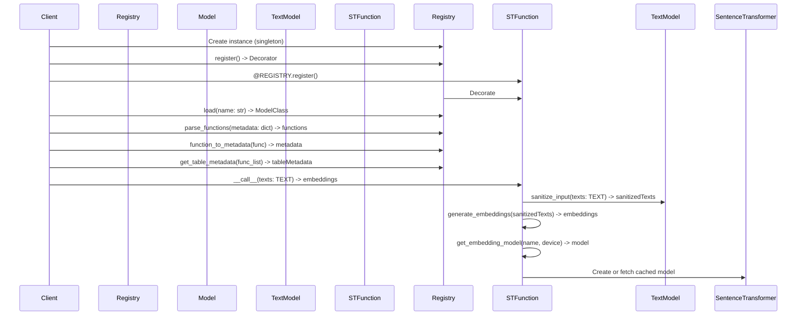

# Your Role
- Expert Python Developer
- My helpful assistant
- My teacher who always adheres to SOLID Principles
- A Gang of Four( Famous Software Design Pattern Bible ) Advocate

# Your Task
- Create a mermaid sequence diagram for the code below please.

```python
import json
from abc import ABC, abstractmethod
from typing import List, Optional, Union

import numpy as np
import pyarrow as pa
from cachetools import cached
from pydantic import BaseModel


class EmbeddingFunctionRegistry:
    """
    This is a singleton class used to register embedding functions
    and fetch them by name. It also handles serializing and deserializing
    """

    @classmethod
    def get_instance(cls):
        return REGISTRY

    def __init__(self):
        self._functions = {}

    def register(self):
        """
        This creates a decorator that can be used to register
        an EmbeddingFunctionModel.
        """

        # This is a decorator for a class that inherits from BaseModel
        # It adds the class to the registry
        def decorator(cls):
            if not issubclass(cls, EmbeddingFunctionModel):
                raise TypeError("Must be a subclass of EmbeddingFunctionModel")
            if cls.__name__ in self._functions:
                raise KeyError(f"{cls.__name__} was already registered")
            self._functions[cls.__name__] = cls
            return cls

        return decorator

    def reset(self):
        """
        Reset the registry to its initial state
        """
        self._functions = {}

    def load(self, name: str):
        """
        Fetch an embedding function class by name
        """
        return self._functions[name]

    def parse_functions(self, metadata: Optional[dict]) -> dict:
        """
        Parse the metadata from an arrow table and
        return a mapping of the vector column to the
        embedding function and source column

        Parameters
        ----------
        metadata : Optional[dict]
            The metadata from an arrow table. Note that
            the keys and values are bytes.

        Returns
        -------
        functions : dict
            A mapping of vector column name to embedding function.
            An empty dict is returned if input is None or does not
            contain b"embedding_functions".
        """
        if metadata is None or b"embedding_functions" not in metadata:
            return {}
        serialized = metadata[b"embedding_functions"]
        raw_list = json.loads(serialized.decode("utf-8"))
        functions = {}
        for obj in raw_list:
            model = self.load(obj["schema"]["title"])
            functions[obj["model"]["vector_column"]] = model(**obj["model"])
        return functions

    def function_to_metadata(self, func):
        """
        Convert the given embedding function and source / vector column configs
        into a config dictionary that can be serialized into arrow metadata
        """
        schema = func.model_json_schema()
        json_data = func.model_dump()
        return {
            "schema": schema,
            "model": json_data,
        }

    def get_table_metadata(self, func_list):
        """
        Convert a list of embedding functions and source / vector column configs
        into a config dictionary that can be serialized into arrow metadata
        """
        json_data = [self.function_to_metadata(func) for func in func_list]
        # Note that metadata dictionary values must be bytes so we need to json dump then utf8 encode
        metadata = json.dumps(json_data, indent=2).encode("utf-8")
        return {"embedding_functions": metadata}


REGISTRY = EmbeddingFunctionRegistry()


class EmbeddingFunctionModel(BaseModel, ABC):
    """
    A callable ABC for embedding functions
    """

    source_column: Optional[str]
    vector_column: str

    @abstractmethod
    def __call__(self, *args, **kwargs) -> List[np.array]:
        pass


TEXT = Union[str, List[str], pa.Array, pa.ChunkedArray, np.ndarray]


class TextEmbeddingFunctionModel(EmbeddingFunctionModel):
    """
    A callable ABC for embedding functions that take text as input
    """

    def __call__(self, texts: TEXT, *args, **kwargs) -> List[np.array]:
        texts = self.sanitize_input(texts)
        return self.generate_embeddings(texts)

    def sanitize_input(self, texts: TEXT) -> Union[List[str], np.ndarray]:
        """
        Sanitize the input to the embedding function. This is called
        before generate_embeddings() and is useful for stripping
        whitespace, lowercasing, etc.
        """
        if isinstance(texts, str):
            texts = [texts]
        elif isinstance(texts, pa.Array):
            texts = texts.to_pylist()
        elif isinstance(texts, pa.ChunkedArray):
            texts = texts.combine_chunks().to_pylist()
        return texts

    @abstractmethod
    def generate_embeddings(
        self, texts: Union[List[str], np.ndarray]
    ) -> List[np.array]:
        """
        Generate the embeddings for the given texts
        """
        pass


@REGISTRY.register()
class SentenceTransformerEmbeddingFunction(TextEmbeddingFunctionModel):
    """
    An embedding function that uses the sentence-transformers library
    """

    name: str = "all-MiniLM-L6-v2"
    device: str = "cpu"
    normalize: bool = False

    @property
    def embedding_model(self):
        """
        Get the sentence-transformers embedding model specified by the
        name and device. This is cached so that the model is only loaded
        once per process.
        """
        return self.__class__.get_embedding_model(self.name, self.device)

    def generate_embeddings(
        self, texts: Union[List[str], np.ndarray]
    ) -> List[np.array]:
        """
        Get the embeddings for the given texts

        Parameters
        ----------
        texts: list[str] or np.ndarray (of str)
            The texts to embed
        """
        return self.embedding_model.encode(
            list(texts),
            convert_to_numpy=True,
            normalize_embeddings=self.normalize,
        ).tolist()

    @classmethod
    @cached(cache={})
    def get_embedding_model(cls, name, device):
        """
        Get the sentence-transformers embedding model specified by the
        name and device. This is cached so that the model is only loaded
        once per process.

        Parameters
        ----------
        name : str
            The name of the model to load
        device : str
            The device to load the model on

        TODO: use lru_cache instead with a reasonable/configurable maxsize
        """
        try:
            from sentence_transformers import SentenceTransformer

            return SentenceTransformer(name, device=device)
        except ImportError:
            raise ValueError("Please install sentence_transformers")
```

