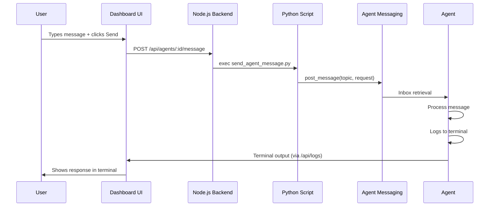

# Dashboard Agent Chat Integration

## Overview

The dashboard now supports **bidirectional communication** with agents. You can:
- ✅ **View real-time terminal output** from agents
- ✅ **Send messages to agents** via a chat input box
- ✅ **Interact with running agents** directly from the dashboard UI

## What Was Added

### 1. Backend API Endpoint

**File:** [`dashboard/backend/server.ts`](file:///home/adamsl/planner/dashboard/backend/server.ts)

Added a new POST endpoint: `/api/agents/:agentId/message`

```typescript
POST /api/agents/dashboard-agent/message
Content-Type: application/json

{
  "message": "launch test browser"
}
```

**Response:**
```json
{
  "success": true,
  "message": "Message sent to agent",
  "response": "Message sent to dashboard-agent on topic 'ops'"
}
```

### 2. Python Message Bridge

**File:** [`send_agent_message.py`](file:///home/adamsl/planner/send_agent_message.py)

A helper script that bridges the Node.js backend to Python's agent messaging system:

```python
def send_to_agent(agent_id: str, message: str):
    """Send a message to an agent"""
    topic = topic_mapping.get(agent_id, 'general')
    
    request = create_jsonrpc_request(
        method="agent.execute_task",
        params={
            "description": message,
            "from": "dashboard-ui"
        }
    )
    
    post_message(message=request, topic=topic, from_agent="dashboard-ui")
```

### 3. Frontend Chat Interface

**File:** [`dashboard/agent-list/managed-agent.ts`](file:///home/adamsl/planner/dashboard/agent-list/managed-agent.ts)

Added chat input component with:
- Text input field
- Send button
- Enter key support
- Disabled state when agent is stopped
- Visual feedback

**Features:**
```typescript
private async sendMessage(message: string) {
    const response = await fetch(`${this.apiUrl}/api/agents/${this.agentId}/message`, {
        method: 'POST',
        headers: { 'Content-Type': 'application/json' },
        body: JSON.stringify({ message: message.trim() })
    });
}
```

## How It Works



## Usage

### 1. Using the Dashboard UI

1. **Navigate to the dashboard** at `http://localhost:3030`
2. **Find the agent** in the "Managed Agents" section
3. **Start the agent** if not already running (click "Start" button)
4. **Type your message** in the input box at the bottom
5. **Press Enter or click "Send"**
6. **Watch the terminal output** above for the agent's response

### 2. Example Messages

For the `dashboard-agent`, try these commands:

```
check status
start server
launch test browser
start test browser with url http://localhost:8080
```

The agent will respond based on its capabilities defined in [`agent.json`](file:///home/adamsl/planner/dashboard_ops_agent/agent.json).

## UI Components

### Chat Input Container

```
┌─────────────────────────────────────────────────┐
│ Terminal Output              dashboard-agent│
├─────────────────────────────────────────────────┤
│ [Agent logs appear here...]                     │
│                                                  │
│                                                  │
├─────────────────────────────────────────────────┤
│ [Type message here...]               [Send]     │
└─────────────────────────────────────────────────┘
```

### Styling Features

- **Dark terminal theme** - Matches terminal aesthetic
- **Monospace font** - Console-like appearance
- **Blue focus state** - Clear visual feedback
- **Disabled state** - Grayed out when agent stopped
- **Responsive layout** - Flexible input with fixed button

## Technical Details

### API Contract

**Request:**
```typescript
interface SendMessageRequest {
  message: string;  // The message to send to the agent
}
```

**Response:**
```typescript
interface SendMessageResponse {
  success: boolean;
  message: string;
  response?: string;  // Output from Python script
}
```

### Topic Mapping

The Python script maps agent IDs to topics:

```python
topic_mapping = {
    'dashboard-agent': 'ops',
    'orchestrator-agent': 'orchestrator'
}
```

**To add new agents:** Update this mapping in [`send_agent_message.py`](file:///home/adamsl/planner/send_agent_message.py)

### Security Considerations

1. **Input sanitization** - Messages are escaped before shell execution
2. **Timeout protection** - 5-second timeout on Python script execution
3. **Error handling** - Graceful failures with user feedback
4. **Agent isolation** - Messages route through proper messaging system

## Testing

### Manual Test

1. **Ensure dashboard is running:**
   ```bash
   cd /home/adamsl/planner/dashboard
   npm start
   ```

2. **Start the dashboard ops agent:**
   ```bash
   cd /home/adamsl/planner/dashboard_ops_agent
   python main.py
   ```

3. **Open dashboard** in browser: `http://localhost:3030`

4. **Send test message:** Type "check status" and press Enter

5. **Verify:** Terminal should show agent processing the message

### Automated Test

Test the Python script directly:
```bash
cd /home/adamsl/planner
python send_agent_message.py dashboard-agent "check status"
```

Expected output:
```
Message sent to dashboard-agent on topic 'ops'
```

## Troubleshooting

### Message not reaching agent

**Symptom:** No response in terminal after sending message

**Solutions:**
1. Verify agent is running (green status badge)
2. Check browser console for errors
3. Verify Python script is executable: `chmod +x send_agent_message.py`
4. Check topic mapping matches agent configuration

### Python script errors

**Symptom:** 500 error in browser console

**Solutions:**
1. Verify virtual environment path in `server.ts` is correct
2. Check Python dependencies are installed: `pip install -r requirements.txt`
3. Test script manually: `python send_agent_message.py test-agent "hello"`

### Chat input disabled

**Symptom:** Cannot type in input box

**Solution:** Start the agent first (click "Start" button)

## Next Steps

### Potential Enhancements

1. **Message history** - Store and display sent/received messages
2. **Auto-complete** - Suggest common commands
3. **Multi-line input** - Textarea for complex messages
4. **Response parsing** - Format structured responses
5. **Typing indicator** - Show when agent is processing
6. **Message templates** - Quick-action buttons for common tasks

### Example: Message History

```typescript
private messageHistory: {text: string, from: 'user'|'agent', time: Date}[] = [];

private async sendMessage(message: string) {
    this.messageHistory.push({
        text: message,
        from: 'user',
        time: new Date()
    });
    // ... send message ...
}
```

## Files Modified

| File | Change |
|------|--------|
| [`dashboard/backend/server.ts`](file:///home/adamsl/planner/dashboard/backend/server.ts) | Added `/api/agents/:id/message` endpoint |
| [`send_agent_message.py`](file:///home/adamsl/planner/send_agent_message.py) | Created message bridge script |
| [`dashboard/agent-list/managed-agent.ts`](file:///home/adamsl/planner/dashboard/agent-list/managed-agent.ts) | Added chat UI and message sending |

## Architecture

### Component Interaction

```
┌──────────────┐
│  Dashboard   │
│     UI       │
└──────┬───────┘
       │ HTTP POST
       ▼
┌──────────────┐
│   Node.js    │
│   Backend    │
└──────┬───────┘
       │ exec()
       ▼
┌──────────────┐
│   Python     │
│   Bridge     │
└──────┬───────┘
       │ post_message()
       ▼
┌──────────────┐
│    Agent     │
│  Messaging   │
└──────┬───────┘
       │ inbox()
       ▼
┌──────────────┐
│    Agent     │
│   Process    │
└──────────────┘
```

## Summary

You now have a **fully interactive agent dashboard** with:
- ✅ Real-time terminal output viewing
- ✅ Chat-based agent interaction
- ✅ Clean, intuitive UI
- ✅ Proper error handling
- ✅ Secure message routing

The dashboard provides a **centralized control panel** for managing and communicating with all your agents!

---

**Created:** 2025-11-19  
**Version:** 1.0  
**Status:** ✅ Complete
